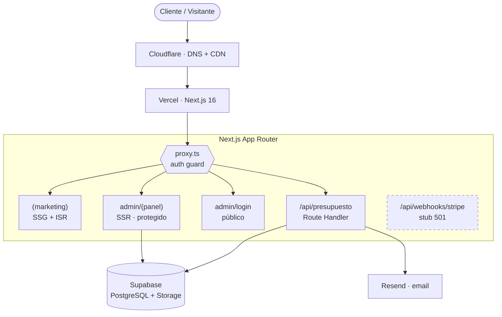
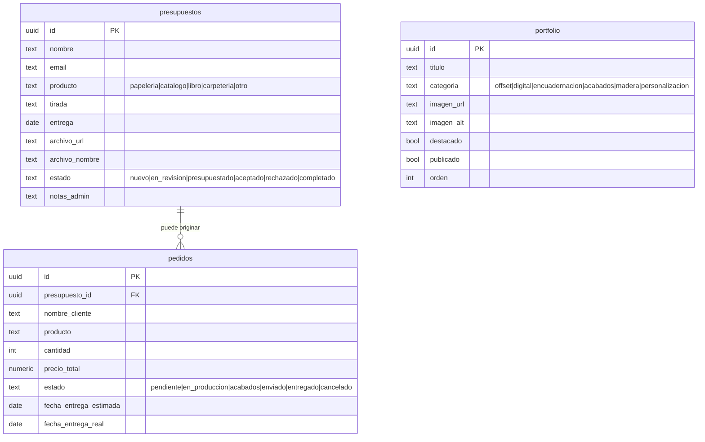
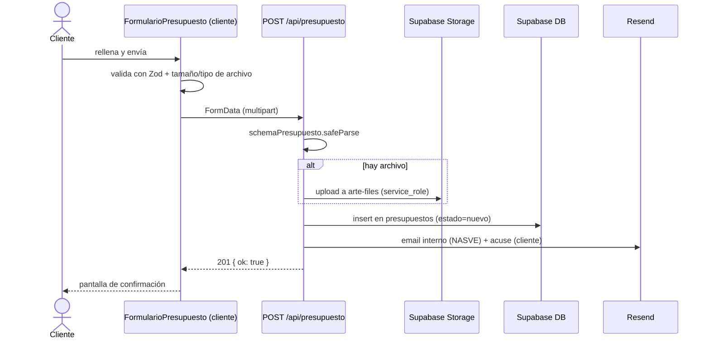

# ARCHITECTURE — graficasnasve.art

> **Estado:** refleja la **implementación real** del repositorio (no un diseño previo).
> Stack: **Next.js 16** · React 19 · TypeScript strict · Tailwind v4 · Supabase · Resend · Vercel · Cloudflare.
> Documentos hermanos: [`ROADMAP.md`](./ROADMAP.md) · [`DEPLOYMENT.md`](./DEPLOYMENT.md) · esquema en [`supabase/migrations/0001_init.sql`](./supabase/migrations/0001_init.sql).

## Propósito

Web de la imprenta **Gráficas NASVE** (Torrent, Valencia · CNAE 1812 · desde 1982). El producto
ataca un dolor concreto del sector: *las soluciones suelen entregarse tarde, caras o
incompatibles*. La arquitectura prioriza por tanto tres cualidades verificables:

- **Rápido** — SSG/ISR para todo lo público; entrega exprés como promesa visible (48 h).
- **Precio claro** — catálogo con precios "desde", estimación orientativa por unidad (planificado).
- **Compatible** — *preflight* de archivos (formato, sangre, resolución, CMYK, tipografías) antes de máquina (planificado).

## Stack real

| Capa | Tecnología | Notas |
|---|---|---|
| Framework | **Next.js 16.2.7** (App Router, Turbopack) | `next lint` eliminado; APIs de request async; `middleware`→`proxy` |
| UI | React **19.2.4**, TypeScript 5 strict | Sin `any` |
| Estilos | Tailwind CSS v4 (`@theme`) | Design System NASVE (negro/papel/oro/tinta) |
| Datos + Auth | Supabase (PostgreSQL, RLS) | `@supabase/ssr` (patrón cookies) |
| Almacenamiento | Supabase Storage · bucket privado `arte-files` | Archivos de arte del cliente |
| Email | Resend | Notificación interna + acuse al cliente |
| Validación | Zod v4 + React Hook Form | Esquema compartido cliente/servidor |
| Formularios | react-hook-form + `@hookform/resolvers` | |
| Hosting | Vercel (región `cdg1`, París) | CI/CD + previews |
| CDN/DNS | Cloudflare | Proxy + caché de assets |
| Gestor de paquetes | pnpm 11 (Node ≥ 20.9) | `pnpm-workspace.yaml` |
| Tests | Vitest + Testing Library · Playwright | CI en GitHub Actions |

## Diagrama de contexto



## Estructura de directorios (real)

```
src/
├── app/
│   ├── (marketing)/            # Grupo público (Navbar + Footer)
│   │   ├── page.tsx            # Home
│   │   ├── historia/ servicios/[slug]/ portfolio/ sostenibilidad/ contacto/ presupuesto/
│   │   └── layout.tsx
│   ├── admin/
│   │   ├── (panel)/            # Área PROTEGIDA (guard + chrome admin)
│   │   │   ├── layout.tsx      # redirect a /admin/login si no hay sesión
│   │   │   ├── page.tsx        # Dashboard de presupuestos
│   │   │   └── presupuestos/[id]/page.tsx
│   │   └── login/page.tsx      # Login — FUERA del guard (evita bucle)
│   ├── api/
│   │   ├── presupuesto/route.ts        # POST multipart → Storage + DB + Resend
│   │   └── webhooks/stripe/route.ts     # Stub 501 (pagos = Fase 4)
│   ├── aviso-legal/ privacidad/ cookies/
│   ├── layout.tsx · globals.css · robots.ts · sitemap.ts
├── components/ui/ · components/marketing/ · components/formularios/
├── lib/
│   ├── supabase/cliente.ts · servidor.ts   # browser / servidor (+admin)
│   ├── resend.ts · catalogoServicios.ts
│   └── validaciones/presupuesto.ts
├── types/supabase.ts           # Tipos de la BD (fuente del esquema)
└── proxy.ts                    # (Next 16) sustituye a middleware.ts
```

## Routing y rendering

- **(marketing)** — estático con ISR. El portfolio revalida (ISR) leyendo de Supabase.
- **admin/(panel)** — SSR; protegido por `proxy.ts` **y** por el guard del layout del grupo.
- **admin/login** — público, fuera de `(panel)` para que sea alcanzable sin sesión.
- **api/** — Route Handlers. `presupuesto` procesa `FormData` (multipart, archivo ≤ 50 MB).

## Autenticación y `proxy.ts`

En Next.js 16 el antiguo `middleware.ts` pasa a llamarse **`proxy.ts`** (runtime Node, no Edge).
Aquí cumple dos funciones siguiendo el patrón `updateSession` de `@supabase/ssr`:

1. **Refresca** la sesión de Supabase en cada request (cookies).
2. **Protege** `/admin/**` (matcher `['/admin/:path*', '/api/:path*']`): sin usuario, redirige a
   `/admin/login` — excluyendo `/admin/login` para no provocar un **bucle de redirección**.

> Defensa en profundidad: el guard se repite en `admin/(panel)/layout.tsx` (la doc de Next
> recomienda no confiar solo en el proxy). El login vive fuera de `(panel)` precisamente para
> que ese guard no lo afecte.

## Modelo de datos

Fuente de verdad: [`src/types/supabase.ts`](./src/types/supabase.ts) → SQL en
[`supabase/migrations/0001_init.sql`](./supabase/migrations/0001_init.sql).



> **`pedidos` es un pipeline de producción** (nace de un presupuesto aceptado), **no** una tabla
> de pedidos de pasarela de pago. La integración de pagos se decide en la Fase 4 del ROADMAP.

### RLS y Storage

- `presupuestos`: INSERT público (formulario), resto solo admin autenticado.
- `pedidos`: solo admin autenticado.
- `portfolio`: SELECT público **solo de `publicado = true`**; resto solo admin.
- Bucket `arte-files` **privado**; la API escribe con `service_role`. Lectura prevista por
  **signed URLs** de TTL corto. *(Deuda técnica: el endpoint usa hoy `getPublicUrl`; ver ROADMAP.)*

## Flujo de presupuesto



## Seguridad y RGPD

- Cabeceras en `next.config.ts`: CSP (sin `unsafe-eval`), `X-Frame-Options: DENY`, `nosniff`,
  `Referrer-Policy`, `Permissions-Policy` (cámara/mic/geo deshabilitados), `poweredByHeader: false`.
- `next/image` con `remotePatterns` para `*.supabase.co` (la config `images.domains` está obsoleta en v16).
- Redirecciones 301 de `graficasnasve.com` → `graficasnasve.art`.
- Fuentes self-hosted (sin peticiones a Google Fonts). Base jurídica de formularios: art. 6.1.b RGPD.
- `SUPABASE_SERVICE_ROLE_KEY` solo en servidor.

## Testing y CI

- **Unitarios (Vitest + Testing Library, jsdom):** validaciones Zod, catálogo, plantillas Resend
  (mock), componentes UI y el formulario. `proxy.ts` se prueba en entorno **node**.
- **E2E (Playwright, Chromium):** home, validación del formulario y guard de `/admin`
  (sin secretos: cubre la redirección a `/admin/login` y la ausencia de bucle).
- **CI** (`.github/workflows/ci.yml`): `typecheck` + `lint` + `test` y un job de `e2e`.
- Scripts: `pnpm typecheck | lint | test | test:e2e`.

## Despliegue

Vercel (`cdg1`) + Supabase (UE) + Resend + Cloudflare. Pasos detallados en
[`DEPLOYMENT.md`](./DEPLOYMENT.md).

## Planificado (ver ROADMAP)

Definido en el briefing `nasveweb2026.pdf` y aún **no implementado**:

- **Tienda** `/tienda` (catálogo con filtros por categoría) y **ficha** `/tienda/[slug]`.
- **Encargo asistido** `/encargo` (configurador de 4 pasos con *preflight* de archivo).
- **Asistente flotante** (chatbot global que cualifica el encargo en 4 preguntas → CRM).
- **Pagos** (Fase 4): comparativa Redsys + Bizum vs Stripe vs Mollie.

## Apéndice — contraste con el diseño previo (reconciliado)

El documento de diseño aportado describía un estado que **no** coincidía con el código. Esta
arquitectura ya está alineada con la realidad; se deja constancia de las diferencias:

| Tema | Diseño previo | Implementación real |
|---|---|---|
| Framework | Next 15 · `middleware.ts` · `app/` | Next 16 · `proxy.ts` · `src/app/` |
| Naming `lib/` | `client/server`, `validations`, `stripe.ts` | `cliente/servidor`, `validaciones`, sin `stripe.ts` |
| `pedidos` | pedidos de Stripe (jsonb, céntimos) | pipeline de producción (FK a presupuesto) |
| `presupuestos`/`portfolio` | otros enums/campos | enums reales + `archivo_nombre`, `imagen_alt`, `publicado`… |
| Pagos | Stripe activo | stub 501; proveedor a decidir (Fase 4) |
| Tienda | implementada | planificada |
