# ROADMAP — tudominio.com

> **Estado:** Pre-producción · base reconciliada con el código real (junio 2026).
> Hermanos: [`ARCHITECTURE.md`](./ARCHITECTURE.md) · [`DEPLOYMENT.md`](./DEPLOYMENT.md).

## Norte del producto

> *Las soluciones del sector suelen entregarse **tarde, caras o incompatibles**.*
> tudominio.com se mide contra ese dolor: **rápido** (SSG/ISR, 48 h exprés),
> **precio claro** (catálogo "desde", estimación por unidad) y **compatible**
> (preflight de archivos antes de máquina). Cada fase debe acercarnos a esos tres ejes.

## Estado actual (snapshot)

```mermaid
flowchart LR
  F0[Fase 0<br/>Fundamentos] --> F1[Fase 1<br/>MVP marketing+presupuesto]
  F1 --> FC[Fase 1.5<br/>Calidad: sanitizar+tests+docs]
  FC --> F2[Fase 2<br/>Tienda + preformatos]
  F2 --> F3[Fase 3<br/>Encargo asistido + preflight]
  F3 --> F4[Fase 4<br/>Asistente flotante / chatbot]
  F4 --> F5[Fase 5<br/>Pagos]
  F5 --> F6[Fase 6<br/>Optimización + Go-live]

  classDef done fill:#dcedc8,stroke:#33691e;
  classDef now fill:#fff3c4,stroke:#c9a84c,stroke-width:2px;
  classDef next stroke-dasharray: 4 4;
  class F0,F1,FC done;
  class F2 now;
  class F3,F4,F5,F6 next;
```

| Fase                                                  | Estado            |
| ----------------------------------------------------- | ----------------- |
| 0 · Fundamentos                                       | ✅ Hecho          |
| 1 · MVP (marketing + presupuesto + admin + portfolio) | ✅ Hecho          |
| 1.5 · Calidad (sanitizar + testing + docs)            | ✅ Hecho          |
| **2 · Tienda + preformatos**                          | 🟡 **Esta tanda** |
| 3 · Encargo asistido + preflight                      | ⏳ Pendiente      |
| 4 · Asistente flotante (chatbot)                      | ⏳ Pendiente      |
| 5 · Pagos                                             | ⏳ Pendiente      |
| 6 · Optimización + Go-live                            | ⏳ Pendiente      |

---

## Fase 0 — Fundamentos ✅
- [x] Dominio `tudominio.com` + redirect 301 desde `tudominioantiguo.com`
- [x] Repo Git + entorno Vercel (`cdg1`)
- [x] Design System Ejemplo v1.0 (tokens, tipografía, color, fuentes self-hosted)

## Fase 1 — MVP ✅

- [x] Home, Historia, Servicios (hub + 6 fichas), Sostenibilidad, Contacto
- [x] Portfolio (ISR 1 h + filtros + lightbox, datos de Supabase)
- [x] Presupuesto: formulario (RHF + Zod) → **Supabase + Resend** _(no n8n, como sí decía el roadmap previo)_
- [x] Panel admin (login + listado + detalle + cambio de estado)
- [x] SEO: metadata, OG, Schema.org `LocalBusiness`+`PrintShop`, `sitemap.ts`, `robots.ts`
- [ ] Google Analytics 4 + Consent Mode v2 _(movido a Fase 6)_

## Fase 1.5 — Calidad 🟡 (esta tanda)

- [x] **Sanitizar código**: webhook Stripe (bloque comentado eliminado → stub documentado),
      imports/variables sin usar eliminados, typo de contenido corregido, `pnpm-workspace.yaml` saneado
- [x] **Bug crítico de auth**: `/admin/login` quedaba en bucle de redirección (lo envolvía el guard del
      layout). Resuelto con grupo de rutas `admin/(panel)` + exclusión en `proxy.ts`
- [x] **Testing completo**: Vitest + Testing Library (unitarios) y Playwright (E2E)
- [x] **CI**: GitHub Actions (`typecheck` + `lint` + `test` + `e2e`)
- [x] **Documentación**: `ARCHITECTURE.md`, `ROADMAP.md`, `DEPLOYMENT.md`, migración SQL real
- [ ] Cobertura ampliada de tests conforme crezcan las features

## Fase 2 — Tienda + preformatos 🟡 (esta tanda)

> Briefing: catálogo navegable con productos "listos para encargar".

- [x] `/tienda`: grid con **filtros por categoría** (Publicidad, Editorial, Hostelería, Identidad, Gran formato, Producto)
- [x] `/tienda/[slug]`: **ficha de producto** con specs (formato, gramaje, acabado), cantidad y **estimación €/ud en vivo**
- [x] Modelo de datos de productos/preformatos: **catálogo estático en código** (`src/lib/catalogoTienda.ts`), no una tabla Supabase — los preformatos son curados y estables, lo que da SSG total y tests deterministas. El motor de precio vive en `src/lib/precioTienda.ts`
- [x] Tarjetas con precio "desde" y CTA — la ficha enlaza a `/presupuesto` con el producto prefijado _(el "subir archivo" + preflight llega en Fase 3)_
- [x] SEO de producto: Schema.org `Product` + `BreadcrumbList` (y `CollectionPage` en `/tienda`)
- [ ] **Precios reales**: sustituir los coeficientes orientativos de `precioTienda.ts` por la tarifa de Ejemplo

## Fase 3 — Encargo asistido + preflight ⏳

> Briefing `/encargo`: configurador guiado de 4 pasos, ref. `NSV-AAAA-NNNN`, respuesta < 24 h.

- [ ] Flujo: **Producto → Especificaciones → Tu archivo (preflight) → Presupuesto**
- [ ] **Preflight** de archivo: formato + sangre, resolución, modo de color (CMYK), tipografías, marcas de corte
- [ ] Opción "que lo diseñe Nasve"
- [ ] Estimación viva por campo; persistencia en `presupuestos`/`pedidos`

## Fase 4 — Asistente flotante (chatbot) ⏳

> Briefing: burbuja global que **cualifica el encargo en 4 preguntas** y captura contacto.

- [ ] Componente flotante (esquina inferior derecha), accesible y con `prefers-reduced-motion`
- [ ] Guion de cualificación (producto → tamaño/nº páginas → … → email/teléfono)
- [ ] Volcado del resumen al formulario de presupuesto y al CRM
- [ ] _(Opcional)_ asistencia con IA — si se usa LLM, evaluar proveedor y coste

## Fase 5 — Pagos ⏳

> Decisión abierta (la elige la clienta según banco y volumen). El webhook está como **stub 501**.

- [ ] **Comparativa**: Redsys + Bizum (TPV del banco, barato en tarjeta nacional) vs Stripe (mejor DX, comisión mayor) vs Mollie (Bizum+tarjeta)
- [ ] Integrar proveedor elegido + activar `/api/webhooks/stripe` (o equivalente)
- [ ] Conectar con el pipeline `pedidos` (estados de producción) y notificación por email
- [ ] Documentar claves/secretos en `DEPLOYMENT.md`

## Fase 6 — Optimización + Go-live ⏳

- [ ] Core Web Vitals (LCP < 2,5 s · CLS < 0,1 · INP < 200 ms) + Lighthouse CI
- [ ] GA4 + Consent Mode v2 (RGPD) y banner de cookies
- [ ] Search Console: verificar + enviar `sitemap.xml`
- [ ] Reseñas Google (QR en taller) · anuncio en redes
- [ ] UAT con Alicia (cliente final)

## UX transversal — Visita guiada ✅

- [x] **Onboarding interactivo** (`src/components/marketing/TourBienvenida.tsx`, driver.js):
      se autolanza una vez por visitante (recordado en `localStorage`), recorre
      Logo → Tienda → Encargo → CTA presupuesto → Asistente, respeta
      `prefers-reduced-motion`, popovers tematizados con el DS Ejemplo y botón flotante
      «Visita guiada» para relanzarlo. Cubierto por `e2e/tour.spec.ts`.

## Deuda técnica / transversal

- [ ] Storage: pasar de `getPublicUrl` a **signed URLs** (bucket privado `arte-files`) + TTL 90 días
- [ ] Observabilidad: Sentry (errores) y analítica de producto
- [ ] Endpoint `/api/auth/signout` referenciado por el admin (verificar que existe/funciona)
- [ ] Imágenes reales del taller (reemplazar placeholders)

## KPIs de éxito (90 días post-lanzamiento)

| Métrica | Baseline | Target |
|---|---|---|
| Presupuestos web/mes | ~0 | ≥ 10 |
| Posición "imprenta Tu Ciudad" | no indexado en `.art` | Top 5 |
| Reseñas Google | — | Objetivo |
| Ventas tienda online/mes | 0 | ≥ 5 |
| Core Web Vitals | N/A | Todo en verde |
